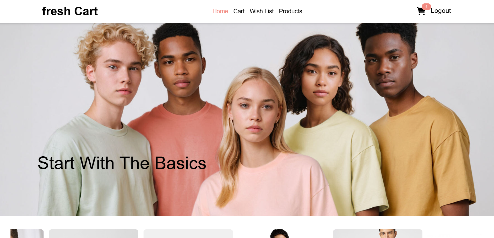
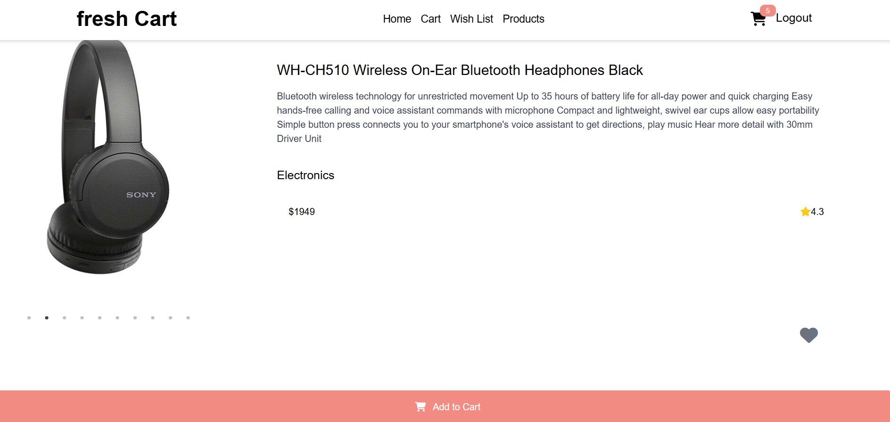
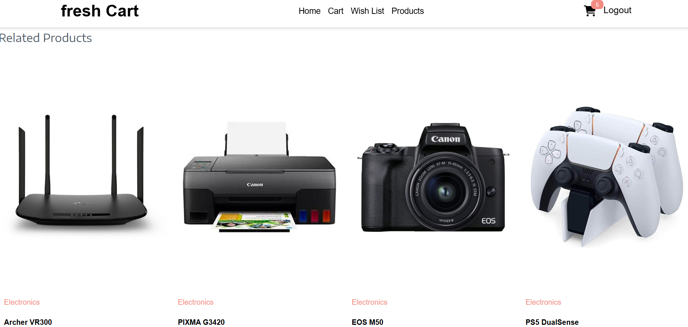
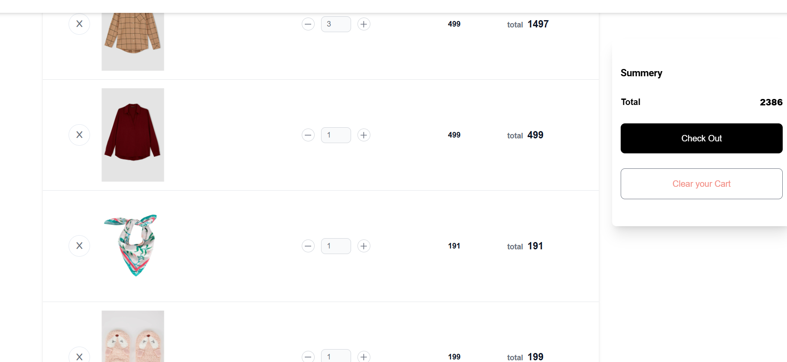
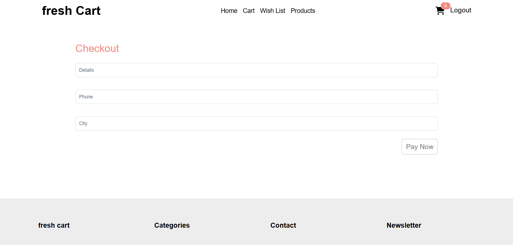
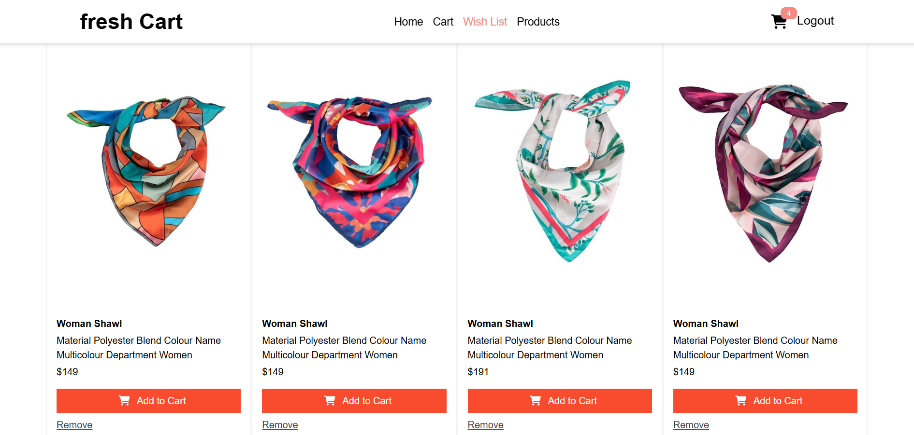
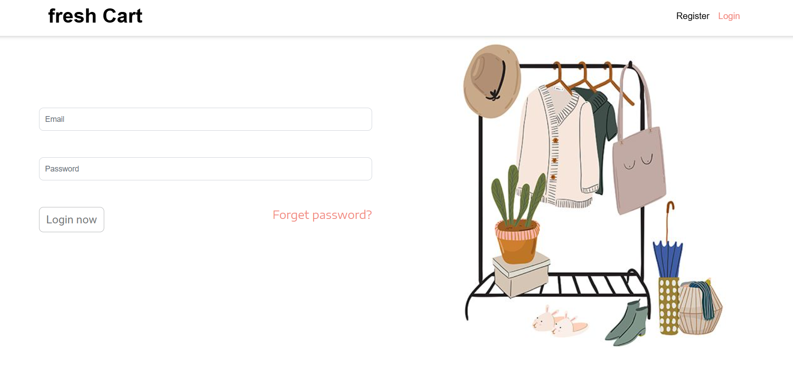
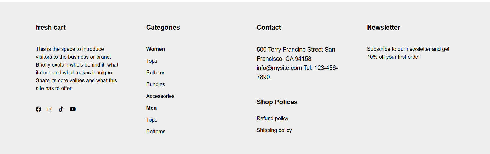

# React Store

## Overview
React Store is a fully functional, modern e-commerce web application built with React. It features authentication, product catalog browsing, wishlist management, shopping cart, and secure checkout – all powered by a real backend API (`https://ecommerce.routemisr.com/api/v1/`).  

---

## Features
- **Responsive Design** – Optimized for mobile, tablet, and desktop  
- **Authentication** – User registration, login, logout, and protected routes  
- **Product Catalog** – Browse a wide range of products with search and filtering  
- **Product Details** – View product images, descriptions, prices, and related items  
- **Shopping Cart** – Add, update, and remove products with real-time total calculation  
- **Wishlist** – Save favorite products for future purchase  
- **Checkout & Orders** – Secure order placement and integrated checkout flow  
- **Modern UI** – Built with Bootstrap and Tailwind for a sleek user experience  
- **Fast Performance** – Optimized using Vite build tool  

---

## Screenshots  

  
*Homepage – Product grid with navigation bar and search functionality*  

<br><br>

  
*Product Details – Multiple images, pricing, ratings, and description section*  

<br><br>

  
*Related Products – Recommended products displayed under the product details*  

<br><br>

  
*Products Page – Browse all available products with filtering and sorting*  

<br><br>

  
*Shopping Cart – Item list with quantity update and total calculation*  

<br><br>

  
*Checkout – Order summary and payment options*  

<br><br>

  
*Wishlist – Save your favorite products for later*  

<br><br>

  
*Login – Secure user authentication page*  

<br><br>

  
*Footer – Application footer with navigation links and contact information*  

---

## Technologies Used

### Frontend
- **React 18** – Core UI framework  
- **React Router 7** – Routing and protected navigation  
- **Redux Toolkit** – State management for cart and wishlist  
- **React Query** – Data fetching and caching  
- **Axios** – API integration with backend  
- **Bootstrap 5 / TailwindCSS** – Responsive styling and UI components  
- **Framer Motion** – Smooth animations and transitions  

### Backend API
- **E-commerce API** – Real REST API (`https://ecommerce.routemisr.com/api/v1/`) for authentication, products, cart, wishlist, and orders  

### Development Tools
- **Vite** – Fast development server and optimized builds  
- **ESLint** – Code linting and best practices enforcement  
- **npm** – Package management  

---

## Getting Started

### Prerequisites
- Node.js **v16 or higher**  
- npm **v7 or higher**  

### Installation

1. Clone the repository:
```bash
git clone https://github.com/username/repo-name.git
cd react-store
````

2. Install dependencies:

```bash
npm install
```

3. Start the development server:

```bash
npm run dev
```

4. Open your browser and navigate to:

```
http://localhost:5173
```

---

## Building for Production

```bash
npm run build
```

Output will be in the `dist/` directory.

---

## Project Structure

```
├── public/              # Public assets
├── src/                 # Source files
│   ├── assets/          # Static assets
│   ├── components/      # Reusable components
│   ├── pages/           # Page components
│   ├── services/        # API services
│   ├── App.jsx          # Main application component
│   ├── App.css          # Application styles
│   ├── index.css        # Global styles
│   └── main.jsx         # Entry point
├── docs/                # Documentation resources
│   └── images/          # Screenshots for README
├── .gitignore           # Git ignore file
├── eslint.config.js     # ESLint configuration
├── index.html           # HTML template
├── package.json         # Dependencies and scripts
├── README.md            # Documentation
└── vite.config.js       # Vite configuration
```

---

## License

This project is licensed under the **MIT License** – see the LICENSE file for details.

---

## Acknowledgements

* [React](https://reactjs.org/) – Frontend library
* [Vite](https://vitejs.dev/) – Build tool
* [Redux Toolkit](https://redux-toolkit.js.org/) – State management
* [TailwindCSS](https://tailwindcss.com/) and [Bootstrap](https://getbootstrap.com/) – Styling
* [Routemisr E-commerce API](https://ecommerce.routemisr.com/api/v1/) – Backend API for products, cart, wishlist, and orders


